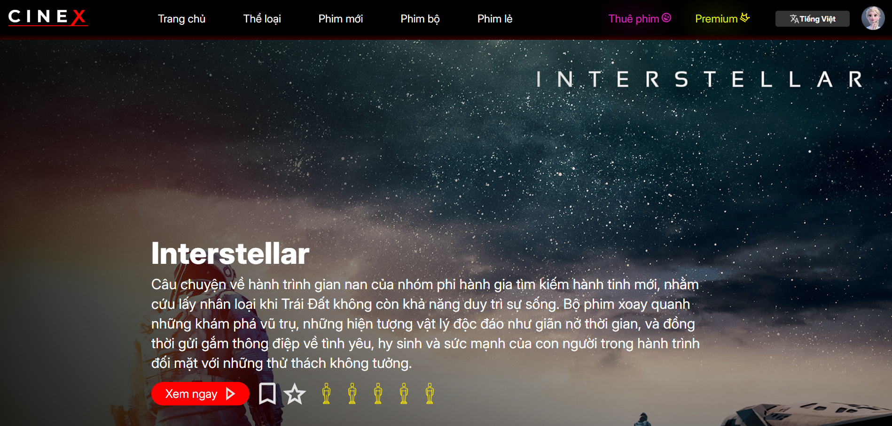
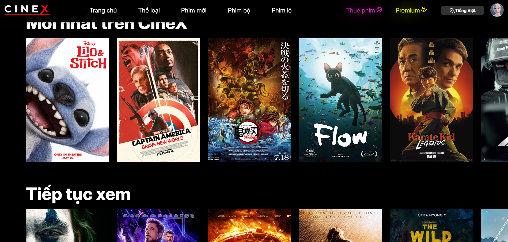
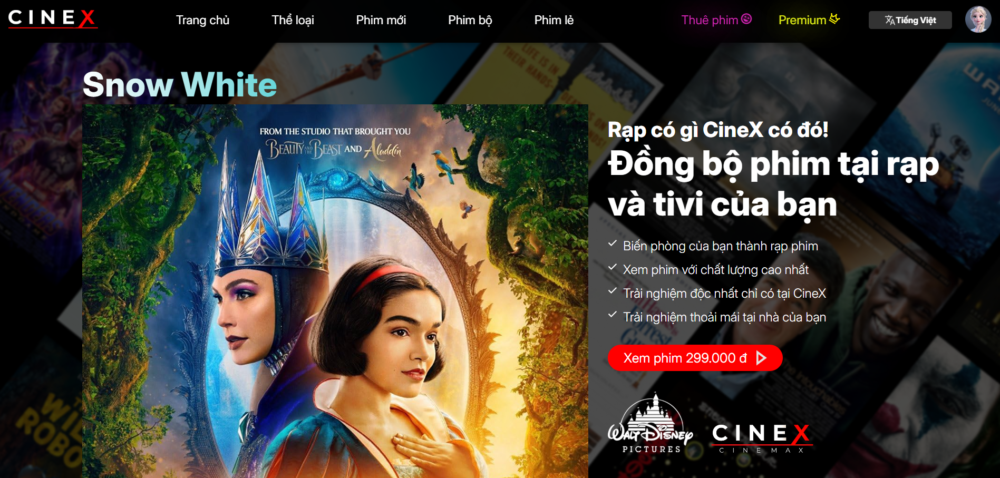
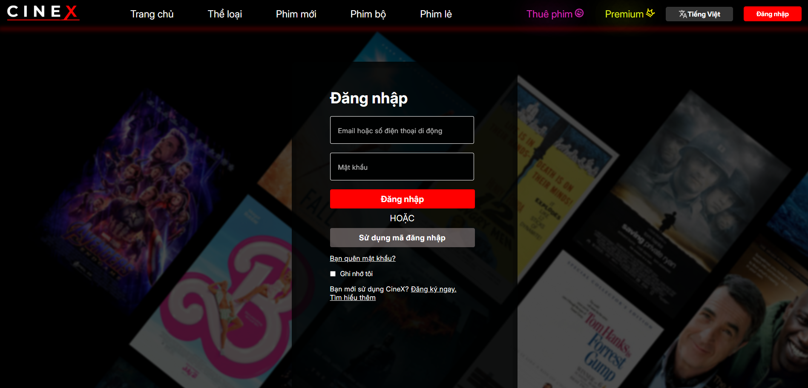
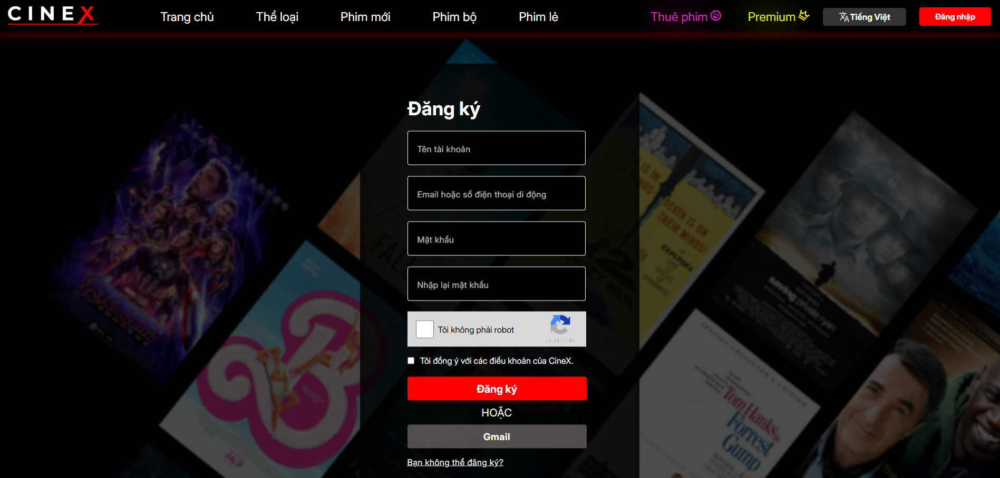
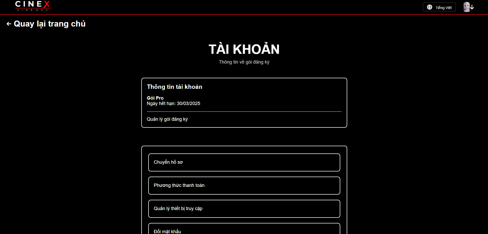
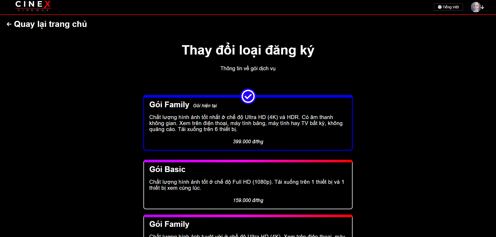
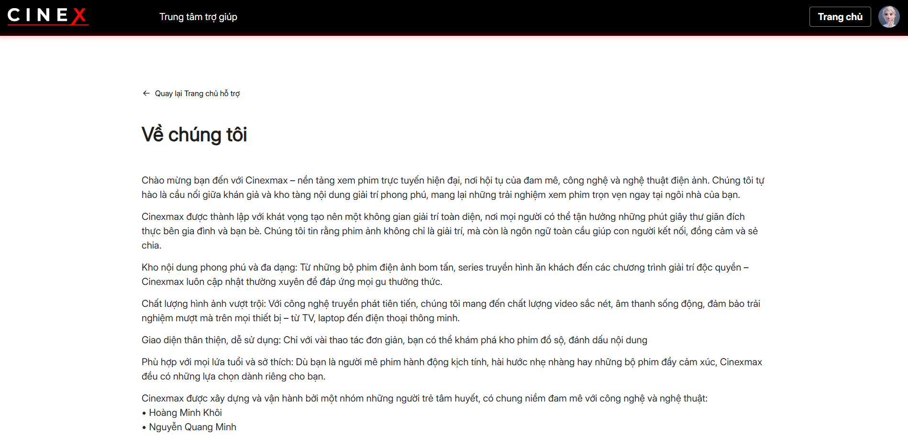
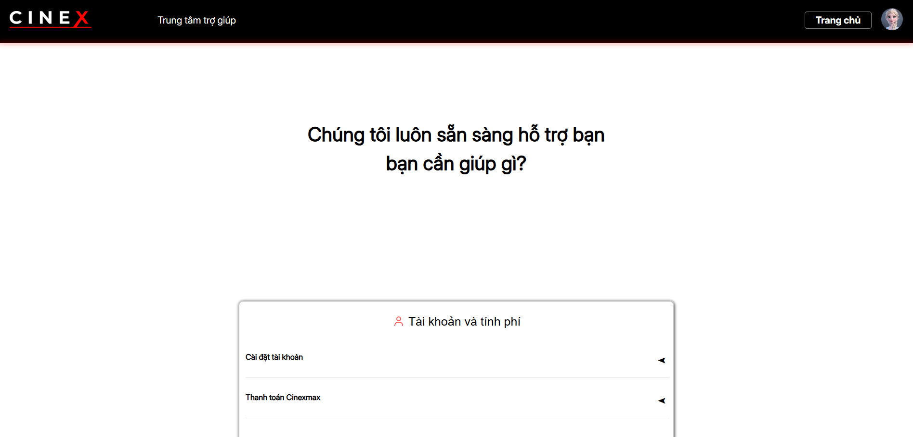

# 🎬 CineX – Web xem phim trực tuyến (Front-End Only)

Chào mừng bạn đến với **CineX** – một website xem phim trực tuyến có trả phí, được phát triển **hoàn toàn bằng HTML, CSS và JavaScript thuần**. Đây là dự án cuối môn của nhóm chúng tôi, tập trung hoàn toàn vào phần **giao diện người dùng (front-end)** mà **không sử dụng bất kỳ backend nào**.

---

## 🌟 Giới thiệu

- 🎥 **Tên dự án:** CineX – Online Movie Streaming
- 🧑‍💻 **Công nghệ sử dụng:** HTML, CSS, JavaScript
- 🚫 **Không sử dụng backend** – toàn bộ là front-end tĩnh
- 📚 **Dự án học phần cuối môn** – học và làm từ con số 0
- ✨ **Trải nghiệm giao diện giống các nền tảng xem phim chuyên nghiệp**

---

## 👨‍👩‍👧‍👦 Thành viên nhóm

| Thành viên | GitHub |
|------------|--------|
|  | [NguyenMinh1301](https://github.com/NguyenMinh1301) |
|  | [DucPhamNgoc08](https://github.com/DucPhamNgoc08) |
|  | [Khoihoangkm](https://github.com/Khoihoangkm) |
|  | [thanhphuc-dev](https://github.com/thanhphuc-dev) |

---

## ⚙️ Tính năng chính

- Giao diện hiện đại, thân thiện với người dùng
- Phân loại phim theo thể loại
- Trang hỗ trợ người dùng
- Trang trả phí và trang thuê phim
- Trang đăng nhập, đăng kí
- Trang landing page
- Trang mua gói

---

## 💡 Ảnh demo

<div style="display: flex; flex-wrap: wrap; justify-content: space-between; gap: 10px;">
    
    
    
    
    
    
    
    
    
    
</div>

---

## 🚀 Cách chạy dự án

1. Tải hoặc clone repository về máy
2. Mở file `index.html` bằng trình duyệt
3. Trải nghiệm giao diện CineX 🎬

4. Clone dự án:
   ```bash
   git clone https://github.com/ten-ban/MOB1024-Java2-Labs.git
---
## Thông Tin Liên Hệ
Nếu bạn có bất kỳ câu hỏi hoặc ý kiến nào, vui lòng liên hệ:

- **Email**: nguyenminh1301.dev@gmail.com
- **GitHub**: [NguyenMinh1301](https://github.com/NguyenMinh1301)

Chúc bạn học tốt!


