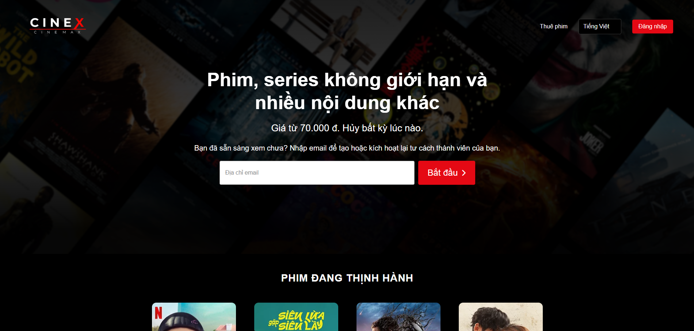

# 🎬 CineX – Online Movie Streaming Website (Front-End Only)

Welcome to **CineX** – a subscription-based online movie streaming website, developed **entirely using HTML, CSS, and vanilla JavaScript**. This is our final project for the course, focusing purely on the **user interface (front-end)** with **no backend implementation**.

---

## 🌟 Introduction

- 🎥 **Project Name:** CineX – Online Movie Streaming
- 🧑‍💻 **Technologies Used:** HTML, CSS, JavaScript
- 🚫 **No backend involved** – purely static front-end
- 📚 **Final course project** – built from the ground up
- ✨ **User interface inspired by professional movie platforms**

---

## 👨‍👩‍👧‍👦 Team Members

<div align="center">

<table>
  <tr>
    <td align="center">
      <br/>
      <a href="https://github.com/NguyenMinh1301">NguyenMinh1301</a>
    </td>
    <td align="center">
      <br/>
      <a href="https://github.com/DucPhamNgoc08">DucPhamNgoc08</a>
    </td>
    <td align="center">
      <br/>
      <a href="https://github.com/Khoihoangkm">Khoihoangkm</a>
    </td>
    <td align="center">
      <br/>
      <a href="https://github.com/thanhphuc-dev">thanhphuc-dev</a>
    </td>
  </tr>
</table>

</div>

---

## ⚙️ Key Features

- Modern, user-friendly interface
- Movie categorization by genre
- User support/help page
- Payment and movie rental pages
- Login and registration pages
- Landing page
- Subscription package page

---

## 💡 Demo Images

<div style="display: flex; flex-wrap: wrap; justify-content: space-between; gap: 10px;">
    
    
    
    
    
    
    
    
    
    
</div>

---

## 🚀 How to Run the Project

1. Download or clone the repository to your local machine
2. Open the `index.html` file in your browser
3. Enjoy the CineX interface 🎬

4. To clone the project:
   ```bash
   git clone https://github.com/ten-ban/MOB1024-Java2-Labs.git
---
📬 Contact Information
If you have any questions or feedback, feel free to reach out:

- **Email**: nguyenminh1301.dev@gmail.com
- **GitHub**: [NguyenMinh1301](https://github.com/NguyenMinh1301)
